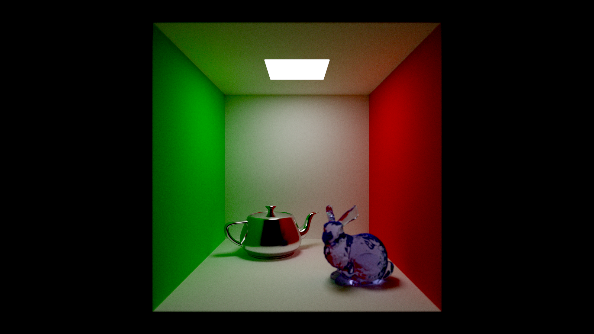
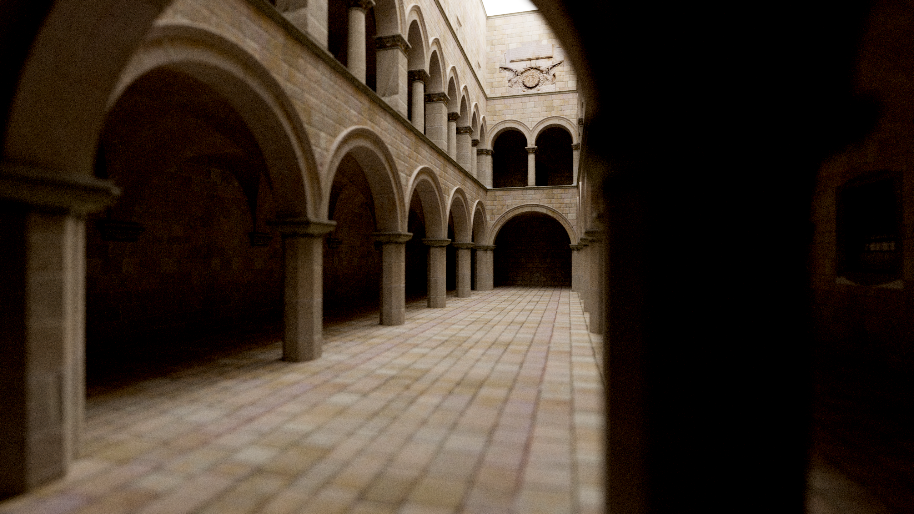
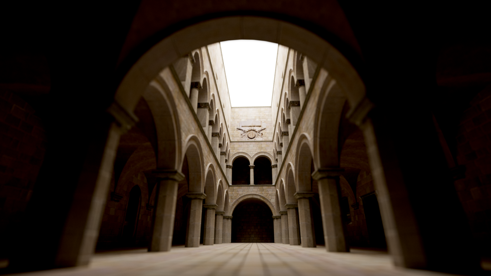

# Path Tracing

A simple path tracing project implemented in Vulkan \& C++

## Requirements

* [Visual Studio 2022](https://visualstudio.com) (Recommended for Windows)
* [Vulkan SDK](https://vulkan.lunarg.com) (Preferably a recent version)

# Getting Started

### Controls
- Hold down right mouse button to unlock the camera
- WASD to move the camera
- QE to elevate the camera
- F to toggle UI

### [More Scenes](https://drive.google.com/drive/folders/1M_iqT96lMv0s2-hHGg3iR9SLaHJWcwY2?usp=drive_link)

## Windows

1. Clone using `git clone --recursive https://github.com/VergilSparda114514/PathTracing.git`
2. Run `compile_shaders.cmd` and `compile_comp_shaders.cmd` in the `PTApp/Resource` folder
3. Run `Setup.bat` in the `scripts` folder
4. Open the `PathTracing.sln` file and hit F5 to compile and run the project (It is recommended to build the project under Release or Dist configurations, as loading the scene might take some time under the Debug configuration)

## Linux

1. Clone using `git clone --recursive https://github.com/VergilSparda114514/PathTracing.git`
2. Run `compile_shaders.sh` and `compile_comp_shaders.sh` in the `PTApp/Resource` folder
3. Run `Setup.sh` in the `scripts` folder
4. Run `make` to build the project

## Screenshots

### 3rd party libaries

* [Dear ImGui](https://github.com/ocornut/imgui)
* [GLFW](https://github.com/glfw/glfw)
* [stb\_image](https://github.com/nothings/stb)
* [GLM](https://github.com/g-truc/glm)
* [tinyobjloader](https://github.com/tinyobjloader/tinyobjloader)

### TODO
* [x] BSDF
* [ ] FFT Bloom
* [ ] ReSTIR GRIS
* [ ] NVIDIA DLSS
* [ ] NVIDIA Ray Reconstruction

